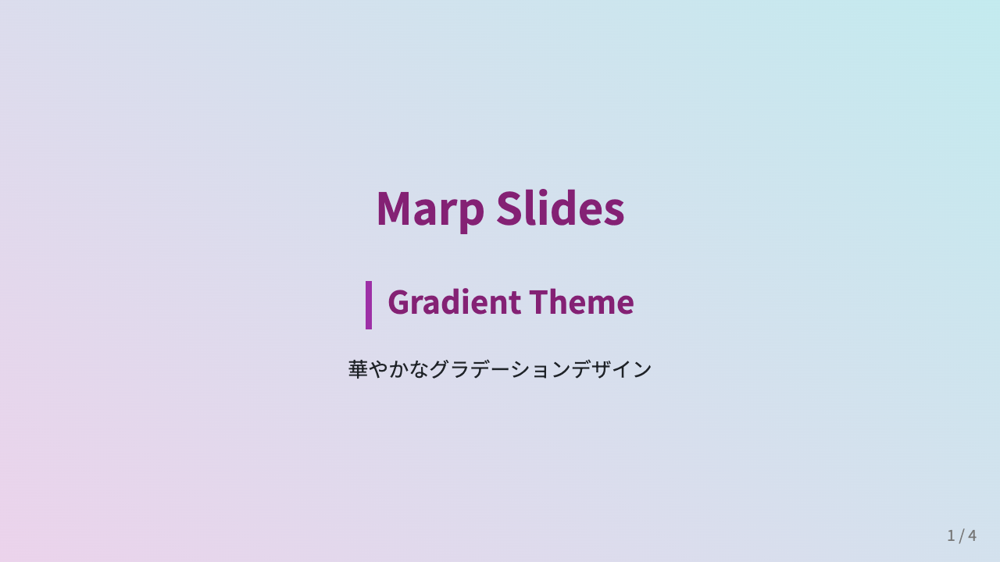

# Marp Slides

Marp（Markdown Presentation Ecosystem）を使ったスライド管理リポジトリ。
Markdown でスライドを書き、PDF/PowerPoint/HTML に自動変換します。

## 🎨 テーマ

<details open>
<summary><strong>Default</strong> - シンプルで汎用的</summary>

<br>


Marp標準テーマ。ミニマルデザインでビジネス用途に最適。

</details>

<details>
<summary><strong>Gradient</strong> - 華やかなグラデーション</summary>

<br>



紫色のグラデーション (#667eea → #764ba2)。クリエイティブなプレゼンテーションに。

</details>

<details>
<summary><strong>Darkmode</strong> - モダンなダークモード</summary>

<br>


目に優しいダーク背景。技術系プレゼンテーションに。

</details>

詳細は[テーマガイド](docs/themes.md)を参照。

## 🚀 クイックスタート

### AIエージェントが使える方（推奨）

AIエージェント（Claude Code, Cursor, GitHub Copilot CLI 等）に以下のようにお願いするだけで、自動で進めてくれます：

| お願いする内容 | AIがやってくれること |
|---------------|---------------------|
| 「セットアップして」 | 環境構築を自動実行 |
| 「スライド作成して」 | 質問しながらスライドを作成 |
| 「ビルドして」 | PDF/PPTX/HTMLを生成 |

エージェントがファイル名、テーマ、内容などを質問してくれるので、答えるだけでスライドが完成します。

### AIエージェントのセットアップがまだの方

→ **[AIエージェントセットアップガイド](docs/ai-agent-setup.md)**

各AIエージェントのインストール方法を解説しています。
セットアップ後、上記の「AIエージェントが使える方」の手順に進んでください。

### 手動でコマンドを実行したい方

AIエージェントを使わずに直接コマンドで操作したい場合：

```bash
make install  # セットアップ
make new      # スライド作成
make build    # ビルド
```

詳細は以下を参照してください：
- [セットアップガイド](docs/setup.md)
- [使い方ガイド](docs/usage.md)

## 📚 ドキュメント

- **[セットアップガイド](docs/setup.md)** - 詳細なインストール手順
- **[使い方ガイド](docs/usage.md)** - スライド作成と Marp 記法
- **[テーマガイド](docs/themes.md)** - テーマの詳細とカスタマイズ
- **[アーキテクチャ](docs/architecture.md)** - プロジェクト構造と設計思想
- **[トラブルシューティング](docs/troubleshooting.md)** - よくある問題と解決方法

## 🔨 よく使うコマンド

```bash
make install              # セットアップ
make new                  # 新規スライド作成
make preview              # ブラウザプレビュー
make build                # 全形式ビルド
make build-one FILE=...   # 単一ファイルビルド
make clean                # 生成物削除
make help                 # ヘルプ表示
```

## 📁 プロジェクト構造

```
marp-slides/
├─ workspace/     # ユーザー作業エリア
│  ├─ slides/     # スライドソース（.md）
│  ├─ img/        # 画像・リソース
│  └─ output/     # 生成物（Git管理外）
├─ system/        # システムファイル
│  ├─ themes/     # カスタムテーマCSS
│  ├─ templates/  # テーマ別テンプレート
│  └─ scripts/    # ビルドスクリプト
└─ docs/          # ドキュメント
```

詳細は[アーキテクチャガイド](docs/architecture.md)を参照。

## 🤝 コントリビューション

1. `make new` でスライドを作成して編集
2. 新しいテーマを追加する場合は `system/themes/new-theme/` を作成して PR
3. テンプレートを改善する場合は各テーマのテンプレートを編集して PR
